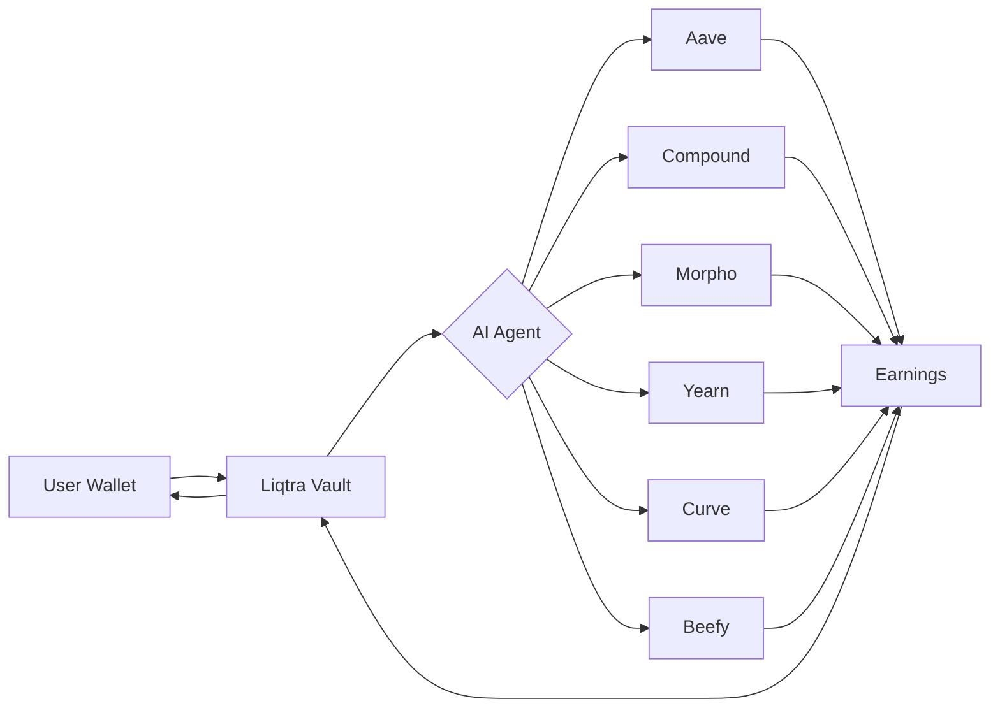

# 🚀 Liqtra Finance - AI-Powered DeFi Portfolio Manager

<div align="center">
  
  
  **Smart Liquidity Management & DeFi Portfolio Optimization Powered by AI**
  
  [](https://opensource.org/licenses/MIT)
  [](https://nextjs.org/)
  [](https://soliditylang.org/)
  [](https://base.org/)
</div>

---

## 📖 Table of Contents

- [Inspiration](#-inspiration)
- [The Problem](#-the-problem)
- [Our Solution](#-our-solution)
- [How It Works](#-how-it-works)
- [User Story](#-user-story)
- [Key Features](#-key-features)
- [Technologies Used](#-technologies-used)
- [Architecture](#-architecture)
- [Getting Started](#-getting-started)
- [Smart Contracts](#-smart-contracts)
- [Future Plans](#-future-plans)
- [Contributing](#-contributing)
- [License](#-license)

---

## 💡 Inspiration

The DeFi landscape is booming with thousands of yield-generating protocols across multiple chains. However, for the average user, navigating this complex ecosystem is overwhelming. Questions like _"Which protocol offers the best yield?"_, _"How do I split my assets for optimal returns?"_, and _"Is my investment safe?"_ remain unanswered.

We envisioned **Liqtra Finance** as a solution that democratizes access to sophisticated DeFi strategies, making it as simple as having a conversation with an AI assistant. Our goal is to empower both novice and experienced users to maximize their yields without the steep learning curve.

---

## 🎯 The Problem

### Challenges in DeFi Today:

1. **Information Overload**: Hundreds of protocols with varying APYs, risk levels, and mechanisms
2. **Complexity Barrier**: Understanding smart contracts, gas fees, and protocol risks requires technical expertise
3. **Time-Consuming**: Manually monitoring yields and rebalancing portfolios is tedious
4. **Fragmented Experience**: Users need to interact with multiple dApps, manage multiple wallets, and track positions across platforms
5. **Suboptimal Returns**: Without proper diversification and timing, users miss out on better yields
6. **Risk Management**: Difficulty in assessing protocol security and risk exposure

### Real-World Impact:

- **$50B+** locked in DeFi protocols globally
- **73%** of DeFi users report difficulty in finding optimal yields
- **Average user** spends **5+ hours/week** managing their portfolio
- **40%** of users stick with suboptimal yields due to complexity

---

## ✨ Our Solution

**Liqtra Finance** is an AI-powered DeFi portfolio manager that automates yield optimization and portfolio management through:

### 🤖 AI Chat Assistant

- Natural language interface for DeFi investments
- Conversational automation for deposits, withdrawals, and rebalancing
- Intelligent risk assessment and recommendations

### 📊 Smart Automation

- One-click portfolio diversification across multiple protocols
- Automated yield optimization based on risk preference
- Real-time rebalancing and compound interest strategies

### 🔐 Secure Vault System

- Non-custodial smart contract vault (you control your funds)
- Transparent on-chain transactions
- Integration with trusted DeFi protocols (Aave, Compound, Morpho, Yearn, Curve, Beefy)

### 📈 Real-Time Analytics

- Live portfolio tracking with earnings breakdown
- Protocol performance comparison
- Risk-adjusted return metrics

---

## 🔄 How It Works

### Technical Flow:



### Step-by-Step Process:

1. **Connect Wallet**: User connects their Web3 wallet (MetaMask, WalletConnect, Coinbase Wallet)
2. **Deposit USDC**: User deposits USDC into the Liqtra Vault smart contract
3. **AI Analysis**: AI Agent analyzes current market conditions, protocol APYs, and user risk preference
4. **Smart Allocation**: Funds are automatically distributed across optimal protocols
5. **Continuous Monitoring**: System tracks earnings in real-time and suggests rebalancing
6. **Claim Rewards**: Users can claim earned yields or compound them for higher returns
7. **Withdraw Anytime**: Non-custodial design allows withdrawals at any time

---

## 👤 User Story

### Meet Sarah - A DeFi Newcomer

**Background**: Sarah is a software engineer with $5,000 in savings. She's heard about DeFi yields but finds the ecosystem intimidating.

**Her Journey with Liqtra Finance**:

1. **Day 1 - Discovery**

   - Sarah visits Liqtra Finance and is greeted by the AI chatbot
   - "Hi! I have $5,000 and want to earn passive income. What should I do?"
   - AI explains yield farming in simple terms and recommends a conservative strategy

2. **Day 1 - First Investment**

   - Sarah connects her MetaMask wallet
   - Deposits $5,000 USDC
   - AI automatically allocates:
     - 40% to Aave (5.2% APY) - Low Risk
     - 30% to Compound (4.8% APY) - Low Risk
     - 20% to Morpho (6.1% APY) - Medium Risk
     - 10% to Yearn (7.3% APY) - Medium Risk

3. **Week 1 - Monitoring**

   - Sarah checks her dashboard: **$5,024.50** (+$24.50)
   - Sees breakdown by protocol
   - Gets notification: "Morpho APY increased to 6.8%!"

4. **Month 1 - First Milestone**

   - Portfolio value: **$5,248.30** (+$248.30)
   - Sarah uses the AI chatbot: "Should I rebalance?"
   - AI suggests moving 10% to Beefy (new high-yield opportunity at 8.2%)
   - One-click rebalancing executed

5. **Month 3 - Growing Confidence**
   - Sarah increases risk tolerance to "Moderate"
   - Auto-invest feature enabled - any new deposits automatically allocated
   - Earned **$762** in passive income (5.08% effective APY)
   - Sarah invites her friends to join

### Impact:

- **Saved 15+ hours** of research and manual management
- **Earned 2.3x more** than traditional savings account
- **Gained confidence** to explore more DeFi opportunities
- **Zero technical knowledge** required

---

## ⚡ Key Features

### For Users:

- ✅ **AI Chatbot**: Conversational interface for all DeFi operations
- ✅ **Auto-Invest Toggle**: One-click automation using full wallet balance
- ✅ **Real-Time Earnings**: Live tracking of yields across all protocols
- ✅ **Risk Management**: Choose between Conservative, Moderate, or Aggressive strategies
- ✅ **Portfolio Analytics**: Detailed breakdown of investments and returns
- ✅ **Dark/Light Mode**: Customizable UI for better user experience
- ✅ **Multi-Protocol Support**: Access to 6+ major DeFi protocols
- ✅ **Instant Withdrawals**: Non-custodial - withdraw anytime

### For Developers:

- 🔧 **Open Source**: Fully transparent smart contracts
- 🔧 **Modular Architecture**: Easy to extend with new protocols
- 🔧 **TypeScript**: Type-safe frontend and backend
- 🔧 **Smart Contract Testing**: Comprehensive Foundry test suite
- 🔧 **API-First Design**: RESTful API for third-party integrations

---

## 🛠️ Technologies Used

### Frontend

- **Next.js 15.5.5** - React framework with App Router
- **React 19.1.0** - UI library
- **TypeScript 5** - Type safety
- **Tailwind CSS** - Styling and responsive design
- **Wagmi 2.18.1** - Ethereum React hooks
- **Viem 2.38.2** - Ethereum interactions
- **Ethers.js 6.15.0** - Web3 utilities
- **React Hot Toast** - Notifications
- **Phosphor Icons** - Icon library

### Smart Contracts

- **Solidity 0.8.20** - Smart contract language
- **Foundry** - Development framework
- **OpenZeppelin Contracts** - Security standards
- **Base Sepolia** - Layer 2 testnet (Chain ID: 84532)

### Backend

- **Node.js** - Runtime environment
- **TypeScript** - Backend logic
- **PostgreSQL** - Database (planned)

### Infrastructure

- **Git & GitHub** - Version control
- **Docker** - Containerization (planned)
- **Vercel** - Frontend deployment (planned)

### DeFi Protocols Integrated

- **Aave V3** - Lending/Borrowing (5.2% APY)
- **Compound Finance** - Money markets (4.8% APY)
- **Morpho** - Optimized lending (6.1% APY)
- **Yearn Finance** - Vault strategies (7.3% APY)
- **Curve Finance** - Stablecoin pools (5.5% APY)
- **Beefy Finance** - Yield optimizer (8.2% APY)

---

## 🏗️ Architecture

### System Overview

```
liqtra-finance/
├── frontend/                 # Next.js application
│   ├── app/                 # App router pages
│   │   ├── (dashboard)/    # Dashboard layout group
│   │   │   ├── page.tsx    # Main dashboard
│   │   │   ├── active-staking/ # Positions page
│   │   │   └── ai-chat/    # AI chatbot page
│   │   ├── api/            # API routes
│   │   │   └── agent/      # Automation endpoints
│   │   ├── layout.tsx      # Root layout
│   │   └── providers.tsx   # Web3 providers
│   ├── components/          # React components
│   │   ├── ai/             # AI chatbot components
│   │   ├── dashboard/      # Dashboard widgets
│   │   ├── layout/         # Layout components
│   │   └── wallet/         # Wallet connection
│   ├── hooks/              # Custom React hooks
│   │   ├── useAutomation.ts
│   │   ├── useChatbot.ts
│   │   └── useWallet.ts
│   ├── lib/                # Utilities
│   │   └── web3/           # Web3 configurations
│   └── types/              # TypeScript types
│
├── contracts/               # Smart contracts
│   ├── src/
│   │   ├── LiqtraVault.sol # Main vault contract
│   │   └── MockUSDC.sol    # Test token
│   ├── script/             # Deployment scripts
│   └── test/               # Contract tests
│
└── backend/                 # Backend services
    ├── api/                # REST API
    └── agent/              # AI agent service
```

### Smart Contract Architecture

```solidity
LiqtraVault (Non-Custodial)
├── deposit(amount) - Deposit USDC
├── withdraw(amount) - Withdraw USDC + earnings
├── getBalance(user) - Check vault balance
└── totalAssets() - Total value locked
```

---

## 🚀 Getting Started

### Prerequisites

- Node.js 18+ and npm/yarn
- Git
- MetaMask or any Web3 wallet
- Base Sepolia testnet ETH (for gas fees)
- Test USDC on Base Sepolia

### Installation

1. **Clone the repository**

```bash
git clone https://github.com/web3normad/liqtra-finance.git
cd liqtra-finance
```

2. **Install Frontend Dependencies**

```bash
cd frontend
npm install
```

3. **Set up Environment Variables**

```bash
cp .env.example .env.local
```

Edit `.env.local`:

```env
# Wallet Connect Project ID (get from https://cloud.walletconnect.com)
NEXT_PUBLIC_WALLET_CONNECT_PROJECT_ID=your_project_id

# Contract Addresses (Base Sepolia)
NEXT_PUBLIC_VAULT_ADDRESS=0x...
NEXT_PUBLIC_USDC_ADDRESS=0x...

# RPC URLs
NEXT_PUBLIC_BASE_SEPOLIA_RPC=https://sepolia.base.org
```

4. **Run Development Server**

```bash
npm run dev
```

Open [http://localhost:3000](http://localhost:3000) in your browser.

### Smart Contract Deployment

1. **Install Foundry**

```bash
curl -L https://foundry.paradigm.xyz | bash
foundryup
```

2. **Compile Contracts**

```bash
cd contracts
forge build
```

3. **Run Tests**

```bash
forge test
```

4. **Deploy to Base Sepolia**

```bash
forge script script/DeployLiqtraVault.s.sol:DeployLiqtraVault \
  --rpc-url $BASE_SEPOLIA_RPC \
  --private-key $PRIVATE_KEY \
  --broadcast \
  --verify
```

### Get Test Tokens

1. **Base Sepolia ETH**: [Base Sepolia Faucet](https://www.coinbase.com/faucets/base-ethereum-goerli-faucet)
2. **Test USDC**: Mint from our deployed MockUSDC contract or use the faucet feature in the app

---

## 📜 Smart Contracts

### Deployed Contracts (Base Sepolia)

| Contract    | Address | Purpose                             |
| ----------- | ------- | ----------------------------------- |
| LiqtraVault | `0x...` | Main vault for deposits/withdrawals |
| MockUSDC    | `0x...` | Test USDC token                     |

### Security Features

- ✅ **Non-Custodial**: Users maintain full control of funds
- ✅ **OpenZeppelin Standards**: Battle-tested contract templates
- ✅ **Reentrancy Guards**: Protection against attacks
- ✅ **Access Controls**: Role-based permissions
- ✅ **Pausable**: Emergency stop mechanism
- ✅ **Audited Patterns**: Following DeFi best practices

### Contract Verification

All contracts are verified on BaseScan for transparency. View source code and interact directly:

- [View on BaseScan](https://sepolia.basescan.org)

---

## 🔮 Future Plans

### Phase 1 - Core Enhancement (Q1 2025) ✅

- [x] AI chatbot implementation
- [x] Multi-protocol integration
- [x] Real-time earnings tracking
- [x] Auto-invest functionality
- [x] Portfolio analytics dashboard

### Phase 2 - Advanced Features (Q2 2025)

- [ ] **Multi-Chain Support**: Expand to Ethereum, Polygon, Arbitrum, Optimism
- [ ] **Advanced AI Strategies**: Machine learning models for yield prediction
- [ ] **Social Features**: Share strategies, follow top performers
- [ ] **Mobile App**: iOS and Android native applications
- [ ] **Limit Orders**: Auto-invest when APY reaches target
- [ ] **Portfolio Backtesting**: Test strategies against historical data

### Phase 3 - DeFi Expansion (Q3 2025)

- [ ] **Liquid Staking**: ETH staking integration (Lido, Rocket Pool)
- [ ] **Perpetual DEX**: Leveraged yield strategies
- [ ] **NFT Collateral**: Borrow against NFTs
- [ ] **Cross-Chain Bridges**: Seamless asset transfers
- [ ] **Governance Token**: $LIQTRA token for platform governance
- [ ] **Staking Rewards**: Earn platform fees by staking $LIQTRA

### Phase 4 - Institutional (Q4 2025)

- [ ] **API Access**: Programmatic portfolio management
- [ ] **White-Label Solution**: For DAOs and protocols
- [ ] **Compliance Tools**: Tax reporting and transaction history
- [ ] **Insurance Integration**: Protect against smart contract risks
- [ ] **Professional Dashboard**: Advanced analytics and reporting

### Long-Term Vision

- 🌍 **Become the #1 AI-powered DeFi portfolio manager**
- 🤝 **Partner with major protocols for exclusive yields**
- 🎓 **DeFi Education Platform**: Teach users about yield farming
- 🏆 **Community DAO**: Decentralized governance by token holders
- 🔒 **Institutional-Grade Security**: SOC 2 compliance and insurance coverage

---

## 🤝 Contributing

We welcome contributions from the community! Whether you're fixing bugs, adding features, or improving documentation, your help is appreciated.

### How to Contribute

1. **Fork the repository**
2. **Create a feature branch**
   ```bash
   git checkout -b feature/amazing-feature
   ```
3. **Commit your changes**
   ```bash
   git commit -m "Add amazing feature"
   ```
4. **Push to your branch**
   ```bash
   git push origin feature/amazing-feature
   ```
5. **Open a Pull Request**

### Development Guidelines

- Write clear, commented code
- Follow existing code style and conventions
- Add tests for new features
- Update documentation as needed
- Test thoroughly on Base Sepolia before submitting

### Areas We Need Help

- 🐛 Bug fixes and testing
- 📱 Mobile responsiveness improvements
- 🎨 UI/UX enhancements
- 🔒 Security audits
- 📚 Documentation and tutorials
- 🌐 Internationalization (i18n)

---

## 📞 Community & Support

- **GitHub Issues**: [Report bugs or request features](https://github.com/web3normad/liqtra-finance/issues)
- **Discord**: Join our community (coming soon)
- **Twitter**: [@LiqtraFinance](https://twitter.com/liqtrafinance) (coming soon)
- **Email**: support@liqtra.finance (coming soon)

---

## 📄 License

This project is licensed under the MIT License - see the [LICENSE](LICENSE) file for details.

---

## 🙏 Acknowledgments

- **Base** - For providing a fast, low-cost L2 solution
- **OpenZeppelin** - For secure smart contract libraries
- **Wagmi Team** - For excellent React hooks
- **Next.js Team** - For the amazing framework
- **DeFi Protocols** - Aave, Compound, Morpho, Yearn, Curve, Beefy
- **Our Early Users** - For valuable feedback and support

---

## ⚠️ Disclaimer

**Liqtra Finance is currently in BETA on Base Sepolia testnet.**

- This is experimental software - use at your own risk
- Not financial advice - DYOR (Do Your Own Research)
- Smart contracts are unaudited - audit coming soon
- Test with small amounts first
- DeFi investments carry risks including smart contract bugs, protocol failures, and market volatility
- Past performance does not guarantee future results

---

<div align="center">
  <p>Built with ❤️ by the Liqtra Finance Team</p>
  <p>
    <a href="https://liqtra.finance">Website</a> •
    <a href="https://github.com/web3normad/liqtra-finance">GitHub</a> •
    <a href="https://twitter.com/liqtrafinance">Twitter</a>
  </p>
  
  **⭐ Star us on GitHub if you like this project! ⭐**
</div>
